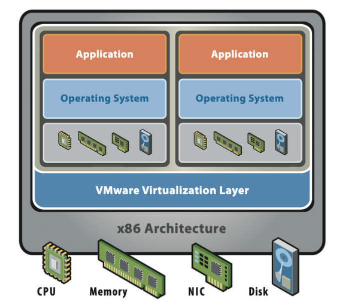
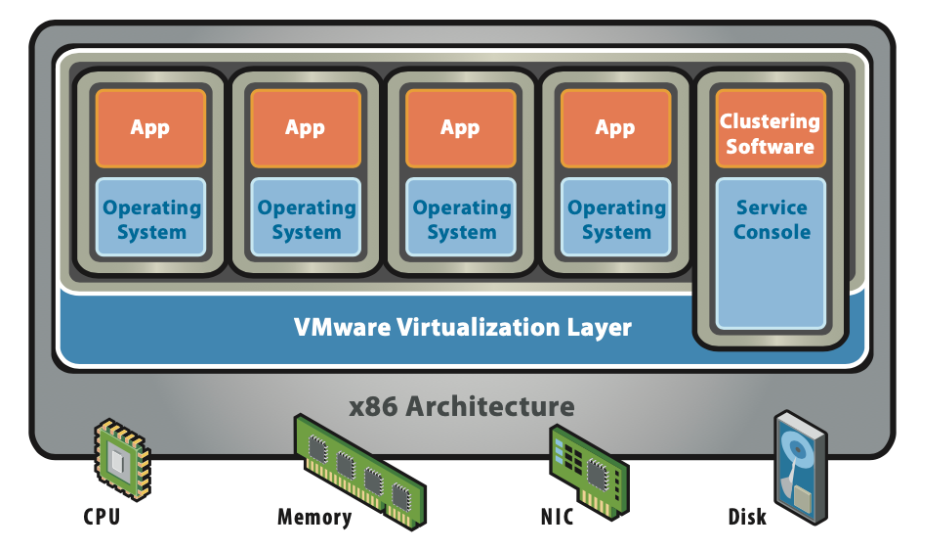
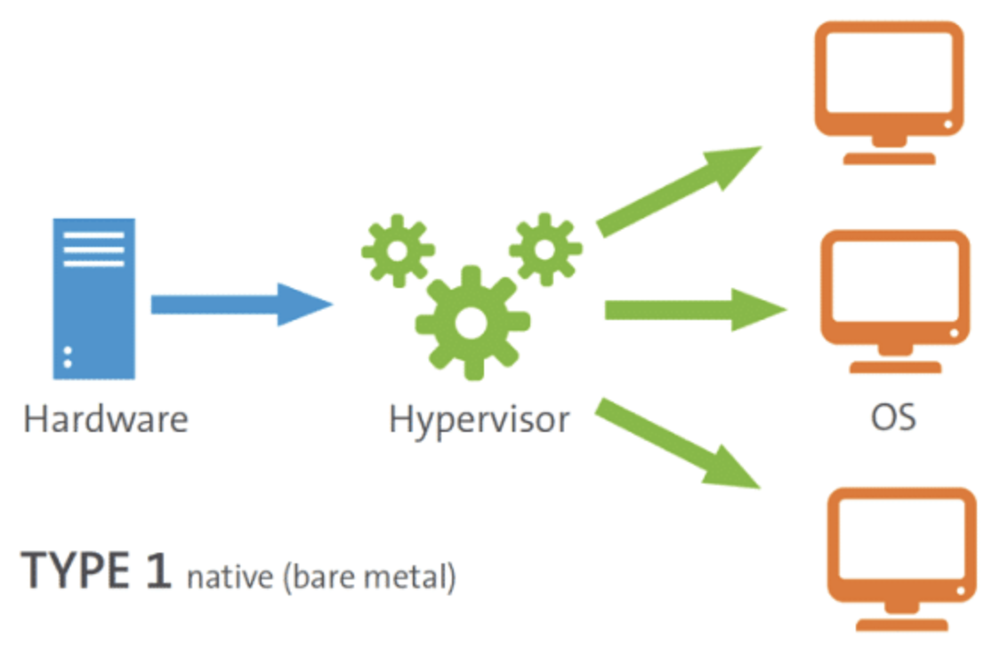
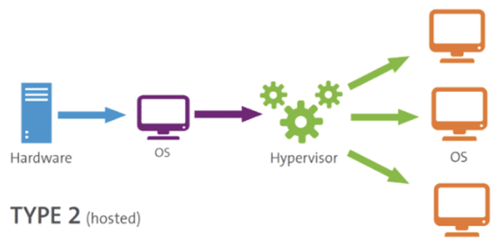
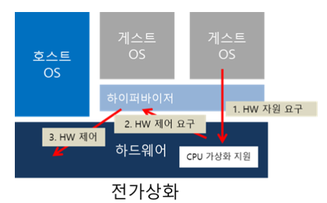
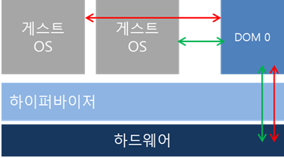
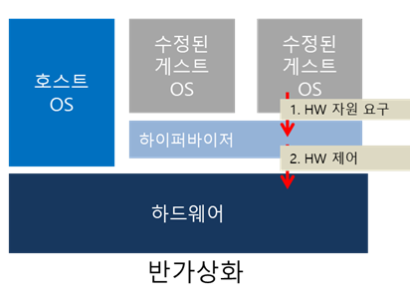

# 🎰 가상머신

## 전통적 배포방식
물리적인 컴퓨터 한 대에 하나의 OS를 깔고 여러 가지 프로그램을 설치하는 방식.

계정을 나눠 여러명의 사용자가 이용할 수 있도록 할 수 있지만 어떤 프로그램을 설치했을 때 다른
앱에 영향을 미친다.

### 계정을 분리해서 관리하는데 문제가있나?
>전통적인 컴퓨터 활용 방식에서, 사용자 계정이 여러 개인 경우, 각 **사용자 계정은** 각각의 설정, 파일, 애플리케이션 등을 **분리하여 관리할 수도** 있음   
>하지만, 프로그램 설치 시 **공유되는 리소스**(예를 들어 시스템 라이브러리나 C 드라이브의 Program Files 폴더 등)도 존재하기에 **완전히 독립적이라고** 할 수는 없다.

### Example
>82109라는 사용자 계정으로 접속하여 해당 계정에 해당하는 폴더(예: C:\Users\82109)에 프로그램을 설치하면 그 프로그램은 기본적으로 82109 계정에만 설치된다.  
>그러나 프로그램에 따라 시스템 전체에 영향을 주는 경우(예: 드라이버 설치, 시스템 레벨 서비스) 
다른 계정에서도 해당 프로그램의 영향을 받을 수 있다

---
## 가상화 배포방식
가상머신을 기반으로 배포하는 걸 의미

가상머신이란 컴퓨터의 **하드웨어를 소프트웨어적으로 구현**한 것

계정을 나누는 것이 아니라 한대의 컴퓨터를 가지고 여러개의 OS를 구동할 수 있게 되며 CPU, RAM을 물리적으로 갈아끼는 것이 아니라 몇번의 설정만으로 이를 수행할 수 있게 됨

가상화 레이어 구조

### 가상서버를 만드는 방법
1. 우선 가상 서버를 만들어달라는 요청을 '**하이퍼바이저**'라는 소프트웨어에 전달.  

2. 요청을 받은 하이퍼바이저는 새로운 가상 서버를 생성하고, 물리 서버가 가진 컴퓨팅 리소스를 각 가상 서버에 할당해줌. 
컴퓨팅 리소스에는 CPU, 메모리, 스토리지, 네트워크 등이 포함된다.

3. 리소스 할당 후에는 각 서버에 필요한 운영체제(OS)도 설치해준다. 
여기까지 완료된다면, 애플리케이션을 실행할 수 있는 서로 다른 가상 컴퓨팅 환경이 만들어진 것임.

이렇게 **자체 컴퓨팅 자원과 OS를 갖춘 가상 컴퓨팅 환경**을 가상 머신, Virtual Machine(VM)이라고 부른다.

각 VM들은 같은 컴퓨터 위에 있을지라도 별도의 시스템처럼 동작함

이때, 생성된 VM서버를 **게스트 서버**, VM들이 구동되게하는 기반 서버를 **호스트 서버**라고 부른다!

---
## 하이퍼바이저란?

하이퍼바이저는 가상화 계층(Virtualization Layer)을 구현해주는 소프트웨어이다.

위 그림을 보면, 실물 하드웨어 자원들과 가상 머신들 사이의 'Virtualization Layer'이라는 가상화 계층을 볼 수 있다.

가상화 구조에서는 하드웨어와 가상 머신이 직접 연결되지 않는다. 
심지어는 하드웨어나 가상 머신들이 자신이 가상화되었다는 사실을 모르게 할때도 있다. 
자기들 **스스로는 온전한 서버라고 생각**하는 것임

그렇기 때문에 우리에게는
- 하드웨어 위에서 가상 머신을 생성하고,
- 필요한 만큼 가상머신에 자원을 할당해주고,
- 가상 머신들의 요청을 처리해주는 등 가상화를 도와줄 '매니저'가 필요함!

그것이 바로 '하이퍼바이저'의 역할이다. 

가상 머신의 생성부터 삭제까지 가상 머신이 동작하는 모든 환경을 관리하기 때문에, 가상 머신 매니저(Virtual Machine Manager 또는 Monitor, VMM)라고 불리기도 한다.

하이퍼바이저는 물리 하드웨어와 가상 머신의 영역을 분리하고 자신이 그 사이에서 중간 관리자, 즉 **인터페이스 역할**을 한다.  
예를 들어, 하드웨어의 리소스를 가상 머신에 할당하고, 각 가상 머신의 리소스 사용을 스케쥴링하고, 가상 머신과 하드웨어 간의 I/O 명령을 처리하는 등의 역할을 하이퍼바이저가 담당한다.

결국 단일 서버에서 여러 개의 OS를 운영할 수 있는 것은 하이퍼바이저 덕분인 것임!

---
### 하이퍼바이저 유형

하이퍼바이저는 Type-1 하이퍼바이저와 Type-2 하이퍼바이저로 구분된다.

### Type-1 하이퍼바이저 (Bare-Metal Hypervisor)

Type-1 하이퍼바이저는 Native 혹은 **Bare-Metal 하이퍼바이저**라고도 불린다. 
'Bare-Metal'이라는 이름에서 알 수 있듯이, Type-1은 하드웨어 위에서 직접 구동되어 게스트 OS를 관리한다. 
하드웨어에 OS를 설치하는 것처럼 하이퍼바이저를 설치하는 것이다.

Type-1 하이퍼바이저에는 **호스트 OS가 따로 존재하지 않는다.**  
**따라서 게스트 OS는 하드웨어 위에 2번째 수준으로 실행**되기 때문에 오버헤드가 적다는 장점이 있다. 
각 게스트 OS의 문제가 다른 게스트 OS에 영향을 주지 않는 것도 Type-1의 장점이다. 

하지만, VM들에 대한 자체적인 관리 기능이 없어, **VM 관리를 위한 컴퓨터나 콘솔이 별개로 필요** 
그래서 **Type-2보다 사용성은 좋지 않다**고 할 수 있을거 같다.

VMware의 ESXi, Citrix의 Xen, Microsoft의 **Hyper-V** 등이 대표적인 Type-1 하이퍼바이저임. 
Type-1 하이퍼바이저는 **기업용 데이터 센터**에서 일반적으로 사용된다.

---
### Type-2 하이퍼바이저 (Hosted Hypervisor)

Type-2 하이퍼바이저는 Hosted 하이퍼바이저라고도 불리며, 그 이름처럼 Host OS를 갖는 하이퍼바이저이다.

하드웨어에 호스트 OS 가 이미 설치되어 있고, 하이퍼바이저는 OS 위에서 소프트웨어로서 동작한다.

**기존 시스템 위에서 쉽게 사용**할 수 있다는 것이 Type-2의 가장 큰 장점이다.  
하지만, 게스트 OS가 **하드웨어 위에 3번째 수준으로 실행**되기 때문에 오버헤드가 크고, 
**호스트 OS의 문제가 전체 게스트 OS에 영향**을 줄 수 있다는 단점이 있다.

VMware의 Workstation, Oracle의 VirtualBox 등의 소프트웨어가 Type-2 하이퍼바이저에 해당된다.

Type-2 하이퍼바이저는 **개인 컴퓨터에서 VM을 사용**하고자 할 때 일반적으로 사용하는 유형이다.  
예를 들어, Windows 환경에서 Ubuntu를 사용하고자 할 때, Windows OS에 VirtualBox 소프트웨어를 다운로드하여 VM을 생성하는 것이 Type-2 방식임.

---

### 가상화 구현 방식

하이퍼바이저는 **가상화를 구현하는 방식**에 따라 전가상화(Full-Virtualization)와 반가상화(Half-Virtualization), HAV(Hardware Assisted Virtualization) 등의 유형으로 나뉜다.

### 전가상화(Full-Virtualization)

전가상화는 이름 그대로 하드웨어를 완전히 가상화하는 것이다. 
즉, 시스템 바이오스, CPU, 메모리등 시스템의 모든 하드웨어를 가상화한다. 
이 방식은 게스트 운영 체제가 **가상화된 환경에서도 마치 실제 하드웨어에서 실행되는 것처럼 동작**하게 한다 
따라서 **게스트 OS는 자신이 가상화된 환경에서 실행되고 있다는 사실을 인식하지 못하며**, 따라서 특별한 수정 없이 기존의 **시스템 호출(System Call)을 그대로 사용**한다.

작동 순서는 아래와 같다.

1. 게스트OS가 HW에 접근하면서 제어를 요구한다.
2. 이 때 CPU는 가상화가 지원가능한지 아닌지를 확인하는데, 지원을 하지 않으면 게스트OS는 아예 운영할 수 없다.
3. 지원 가능하면 하이퍼바이저에게 HW제어를 요구하고, 이후 하이퍼바이저는 HW를 제어할 수 있게 된다.

4. 하이퍼바이저를 베어메탈유형으로 구동하면 DOM 0이라는 관리용 가상머신이 구동된다.
5. 이떄 모든 가상머신의 하드웨어 접근이 이 DOM 0으로 이뤄진다.

즉, 게스트OS가 각각의 언어로 요청하는 **명령들을 DOM 0이 중재(번역)하여** 하드웨어에게 전달한다.

장점

- 하드웨어를 완전히 가상화하기 때문에 게스트OS의 별다른 수정없이 사용할 수 있다. 
  (DOM 0이 번역해서 전달해주기 떄문)

단점
- 하이퍼바이저가 모든 명령을 중재하기 때문에 성능이 비교적 느리다.

---
### 반가상화(Half-Virtualization)

반가상화는 하드웨어를 가상화 하되 완전히 가상화하지는 않는 방식이다.

반가상화에서 하이퍼바이저는 게스트OS와 하드웨어 사이의 번역 역할을 하지 않고, 단지 게스트OS들에게 **자원을 어떻게 분배할지 같은 관리적 문제만 다룬다.**

그러면 전가상화에서 하던 하이퍼바이저의 중재(번역)는 누가 해야 될까?

바로 **게스트OS 각자가** 자체적으로 하드웨어 접근을 위해  **수정**되어야 한다!

게스트OS의 커널을 수정하여(=코드를 까서 수정을 하여) **특권 명령이 수행될 때 System Call 대신Hypercall을 호출**하여 하이퍼바이저가 실행되도록 해야 한다. 

리눅스는 오픈소스라서 소스를 수정할 수 있다. 
윈도우는 원래는 불가능했지만 Xen에서 제공하는 툴로 전부 다 가능해졌다.

즉 반가상화는 중재해주는 DOM 0 가상머신이 없어서 게스트OS를 수정해야 하며, 이것이 반가상화와 전가상화의 차이를 만든다고 할 수 있다.

장점
- 전가상화의 단점인 성능 저하를 해소하고자 모든 명령을 DOM 0을 통해 하이퍼바이저에게 요청하지 않고,
  하이퍼콜(Hyper Call)이라는 인터페이스로 직접 하이퍼바이저에게 하드웨어 접근 요청을 날린다. 
  따라서 전가상화에 비해 성능이 빠르다.

단점
- 하이퍼콜을 이용하면 하이퍼바이저에게 요청을 보내는 동작을 기존의 OS는 할 수 없으므로 커널 수정 작업이 들어가야 한다.

